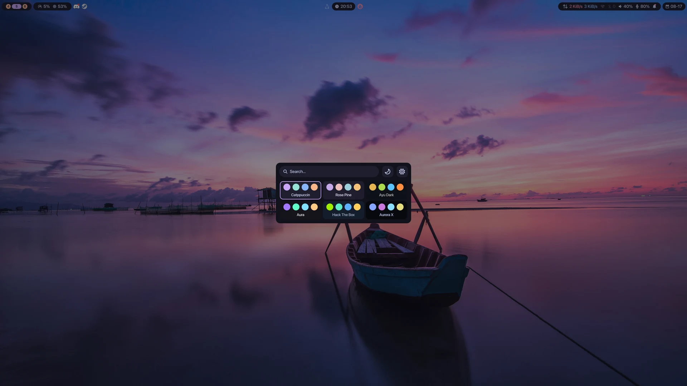
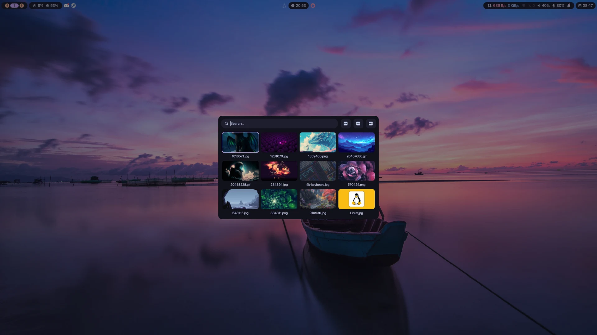
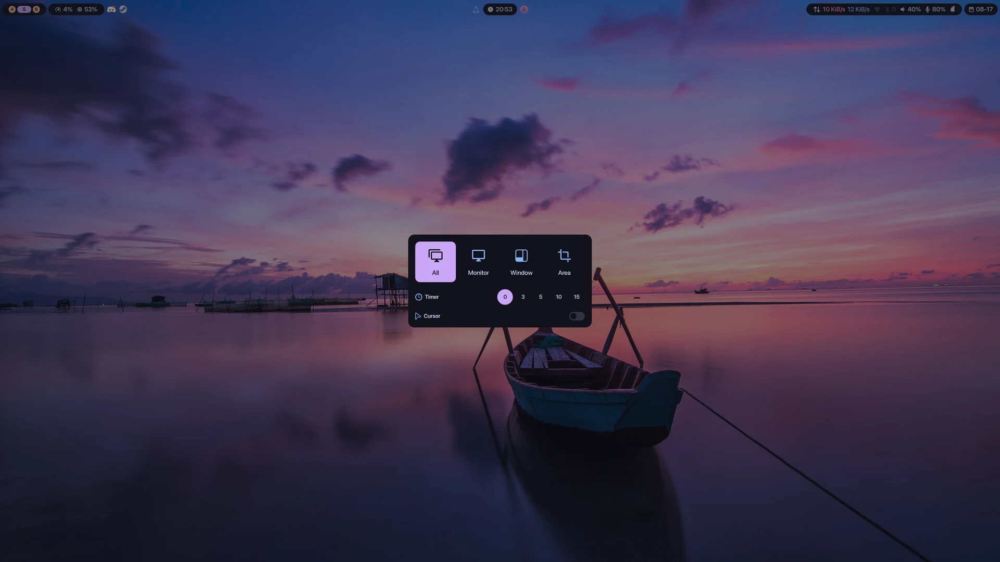

<div align="center">

# hyprshell

**A Wayland desktop shell for Hyprland.**

One process draws your bar, launcher, control center, notifications, screenshots,
wallpapers and themes — and paints Hyprshell, Hyprland and Ghostty to match.

</div>

<div align="center">
  
</div>

<details>
<summary><b>The panels — click to open</b></summary>
<br>

| App launcher | Control center |
|:---:|:---:|
|  |  |
| **Notification center** | **Power menu** |
|  |  |
| **Theme selector** | **Wallpaper selector** |
|  |  |

<div align="center">
  <b>Screenshot tool</b><br>
  
</div>

</details>

## Features

**Status bar.** Workspaces, CPU and RAM, system tray, clock, power profile,
network throughput, Wi-Fi, Bluetooth, sound, backlight, battery, microphone,
notifications, date.
Four of those modules are shortcuts: clicking Wi-Fi opens the control center
*already expanded* on Wi-Fi.

**App launcher.** Type to filter desktop entries. The search field never loses
focus, so the arrows move through the grid and the text cursor without you
reaching for anything.

**Control center.** Wi-Fi, Ethernet, Bluetooth, audio output and microphone, one
section expanded at a time. Connect, forget, switch device, mute a single
application's stream. Wi-Fi scanning is claimed while you are looking and
released when you are not, rather than running forever.

**Notification center.** History that survives a restart, images included. Do not
disturb, clear all, and per-notification expand.

**Screenshot tool.** All screens, one monitor, the focused window, or a region.
Delay up to fifteen seconds, cursor optional. Lands on disk *and* on the
clipboard, and waits for its own overlay to leave the screen first so it never
appears in the shot.

**Wallpaper selector.** Browses your wallpaper directory with search, format
filters and cached thumbnails.

**Theme selector.** Thirteen palettes, applied live — and not just to the shell.
The same colors reach Hyprland's borders, hyprlock's fields and Ghostty's
terminal through one generated file.

**Power menu.** Lock, suspend, log out, reboot, power off, each behind a
confirmation that a stray click cancels rather than confirms.

**Bluetooth pairing.** A device asking for a PIN or a six-digit confirmation gets
a real dialog, served by a small companion agent — because Quickshell cannot own
a D-Bus object and BlueZ refuses a pairing nobody can answer.

---

## Quick start

Four steps. The shell starts after the first three; the fourth is what makes it
start on its own and answer your keys.

### 1. Install

```sh
pacman -S hyprland ttf-nerd-fonts-symbols
paru -S quickshell-git awww
```

That is the minimum that draws a working bar. [Requirements](#requirements) has
the rest — every one of them buys exactly one feature, and the shell starts
without any of them.

### 2. Turn the services on

Installing a daemon does not start it, and the control center reads these over
D-Bus rather than shelling out. A service that is off reports its section
unavailable rather than failing.

```sh
sudo systemctl enable --now NetworkManager bluetooth
systemctl --user enable --now pipewire wireplumber
```

### 3. Install the shell

```sh
curl -fsSL https://raw.githubusercontent.com/adanft/hyprshell/main/install.sh | sh
```

That puts the shell in `~/.config/hyprshell` and the `bagent` pairing agent on
your PATH. Nothing is compiled and nothing is cloned — the release carries a
built binary, and the repository stays where it belongs. Run the same line again
to upgrade: it replaces what it installed last time and leaves your
`settings.json` alone.

### 4. Wire it into `hyprland.lua`

```lua
local hyprshell = os.getenv("HOME") .. "/.config/hyprshell"

hl.on("hyprland.start", function()
    hl.exec_cmd("awww-daemon")           -- the wallpaper daemon, see below
    hl.exec_cmd("qs -p " .. hyprshell)
end)

hl.bind("SUPER + D", hl.dsp.exec_cmd("qs ipc -p " .. hyprshell .. " call applauncher toggle"))
hl.bind("SUPER + T", hl.dsp.exec_cmd("qs ipc -p " .. hyprshell .. " call themeselector toggle"))
hl.bind("SUPER + B", hl.dsp.exec_cmd("qs ipc -p " .. hyprshell .. " call wallpaperselector toggle"))
hl.bind("SUPER + X", hl.dsp.exec_cmd("qs ipc -p " .. hyprshell .. " call powermenu toggle"))
hl.bind("Print",     hl.dsp.exec_cmd("qs ipc -p " .. hyprshell .. " call screenshot toggle"))
```

The control center and the notification center need no binds — they open from the
bar, because both anchor themselves to the module you clicked.

**`awww-daemon` is yours to start.** The shell only ever runs `awww img` to apply
a picture; it never launches the daemon and never checks for it. With the daemon
down, picking a wallpaper looks like it worked — the selector closes, the choice
is saved — and the screen does not change. You do not need `awww restore`: the
daemon reads its own cache on start and puts the last wallpaper back per output,
which is what `--no-cache` exists to turn off.

### Two things the shell deliberately leaves to you

| | Why it is yours |
|---|---|
| **A lock handler** | The power menu's Lock runs `loginctl lock-session`, which asks logind to lock rather than launching a locker itself. Something has to be listening — on Hyprland that is usually `hypridle` with `lock_cmd = hyprlock`. With `hyprlock` installed but nothing registered, the button does nothing at all. |
| **Sourcing `theme.conf`** | The shell writes the palette; it does not edit your `hyprlock.conf` or your `hyprland.lua`. [Theming the rest of the desktop](#theming-the-rest-of-the-desktop) is the two blocks to paste. |

### Check it worked

```sh
qs -p ~/.config/hyprshell     # the bar appears, with icons rather than boxes
command -v bagent awww-daemon # both resolve
```

---

## Requirements

Package names are Arch's, because that is where it was built and tested. On
another distribution the binaries are the same; only the package names move.
Versions are not listed because none of them matter — install what your
repositories have.

Only the first two are required. Everything below them costs exactly one feature
if it is missing, and the shell starts either way.

Four of these are daemons rather than commands: `networkmanager`, `bluez`,
`pipewire` and `wireplumber` are reached over D-Bus, so installing them is half
the job and [step 2](#2-turn-the-services-on) is the other half. `awww` is a
third case — a command *and* a daemon, and the daemon is one you start yourself.

| Package | Repo | What it gives you |
|---|---|---|
| `hyprland` | official | **Required.** The compositor. The shell talks to it over its IPC, and the launch hook lives in `hyprland.lua`. |
| `quickshell-git` | AUR | **Required.** The runtime, and Qt 6 with it. |
| `ttf-nerd-fonts-symbols` | official | Every icon in the shell. They are font codepoints, not images, so without it the bar is empty boxes. |
| `networkmanager` | official | Wi-Fi and Ethernet, and the connection details — address, profile — in the control center. |
| `bluez` `bluez-utils` | official | Bluetooth. `bluez-utils` is what starts a pairing; devices already paired keep working without it. |
| `pipewire` `wireplumber` | official | Volume, output and input devices, and the per-application streams. |
| `upower` | official | Battery. |
| `systemd` | official | logind, which is what the power menu's session actions go through. |
| `accountsservice` | official | The user's avatar, read over `busctl`. Without it the avatar is simply empty. |
| `grim` `slurp` `wl-clipboard` `jq` | official | The screenshot tool. All four are one pipeline: `slurp` picks the region, `hyprctl`+`jq` resolve the focused window, `grim` captures, `wl-copy` puts it on the clipboard. |
| `imagemagick` | official | Wallpaper thumbnails. Without it the grid falls back to full images. |
| `brightnessctl` | official | The brightness control, which otherwise reports itself unavailable and disappears. |
| `ghostty` `glib2` | official | The terminal following the theme. `gapplication` is what tells Ghostty to reload. |
| `hyprlock` `hypridle` | official | Locking. The power menu asks logind, so a locker alone is not enough — `hypridle` is what listens and runs `lock_cmd = hyprlock`. Installing one without the other leaves the Lock button silent. |
| `awww` | AUR | Applying a wallpaper — and `awww-daemon` has to be running for it to land. The selector still browses and still remembers your choice without either. |

```sh
pacman -S hyprland ttf-nerd-fonts-symbols networkmanager bluez bluez-utils \
          pipewire wireplumber upower accountsservice \
          grim slurp wl-clipboard jq imagemagick brightnessctl \
          ghostty glib2 hyprlock hypridle

paru -S quickshell-git awww
```

`bagent` is not on that list because it is not a package: it is the Bluetooth
pairing agent, and the installer already put it on your PATH, built. Quickshell
cannot serve a D-Bus object, so `org.bluez.Agent1` lives in that separate
process. Without it a device asking a question — a phone confirming six digits, a
keyboard wanting a PIN typed — has nobody to answer and BlueZ refuses the
pairing. Devices that pair with no interaction still work.

### Fonts

Body text is set in **SF Pro Display**, named in `theme/Typography.qml`. It is not
in the repositories — install it yourself, or change that one line to a face you
have. Qt will substitute silently if it is missing, so nothing breaks; it just
stops looking the way it was drawn.

---

## Using it

### The bar

| Cluster | Holds | What responds |
|---|---|---|
| **Left** | Workspaces · CPU, RAM · system tray | A workspace pill focuses that workspace. Tray items open their own menus. The tray disappears when nothing is in it. |
| **Center** | Control center button · clock · power profile | The button opens the control center with nothing expanded. |
| **Right** | Network throughput · Wi-Fi · Bluetooth · sound · backlight · battery · microphone · notifications · date | Four are shortcuts — below. |

| Click | Opens |
|---|---|
| Wi-Fi | Control center, Wi-Fi expanded |
| Bluetooth | Control center, Bluetooth expanded |
| Sound | Control center, audio output expanded |
| Microphone | Control center, microphone expanded |
| Notifications | Notification center |

The throughput readout is a readout, not a button.

### One panel at a time, and how to close it

The five panels you open yourself — launcher, power menu, wallpaper selector,
theme selector, screenshot tool — are mutually exclusive. Opening one closes
whatever was up, and closes it by *destroying* it rather than hiding it, so a
panel you are not looking at costs nothing while it is away.

The Bluetooth pairing dialog is the exception in both directions: it displaces
those five, and nothing displaces it. Closing it means refusing a pairing BlueZ
is waiting on, which is not a decision another panel should be able to make by
opening.

The control center and the notification center sit outside that arrangement —
they belong to the bar, and either can be up alongside anything else.

| Panel | Escape | Click outside |
|---|---|---|
| App launcher, power menu, wallpaper selector, theme selector, screenshot tool | closes | closes |
| Bluetooth pairing | rejects | — |
| Control center | — | closes |
| Notification center | — | — |

The notification center closes the way it opened: by clicking the bar's
notification module again.

### Keys

<details open>
<summary><b>App launcher</b></summary>

| Key | Does |
|---|---|
| Any character | Filters |
| ← → | Moves one app — unless the text cursor has somewhere to go, in which case it moves the cursor |
| ↑ ↓ | Moves one row |
| Enter | Launches and closes |
| Escape | Closes |

</details>

<details>
<summary><b>Screenshot tool</b></summary>

Four modes: **All** (every screen), **Monitor**, **Window** (the focused one,
resolved through `hyprctl`), **Area** (dragged with `slurp`).

| Key | Does |
|---|---|
| ← → | Picks the mode |
| ↑ ↓ | Includes or excludes the cursor |
| Tab / Shift+Tab | Cycles the delay: 0, 3, 5, 10, 15 seconds |
| Enter | Captures |
| Escape | Closes |

Captures land in `~/Pictures/Screenshots` **and** on the clipboard.

</details>

<details>
<summary><b>Wallpaper selector</b></summary>

Browses `~/Wallpapers` — override with `AWWW_WALLPAPERS_DIR`.

| Key | Does |
|---|---|
| Any character | Filters by name |
| ← → ↑ ↓ | Moves through the grid |
| Enter | Applies and closes |
| Escape | Closes |

Three format filters — **png**, **jpg**, **gif** — toggle independently, so
several can be on at once. Thumbnails are cached under
`$XDG_CACHE_HOME/hyprshell/wallpapers`.

</details>

<details>
<summary><b>Theme selector</b></summary>

Thirteen palettes ship with it:

`atom-one-light` · `aura` · `aurora-x` · `ayu-dark` · `catppuccin` ·
`catppuccin-latte` · `hack-the-box` · `kanagawa-dragon` · `kanagawa-lotus` ·
`kanagawa-wave` · `one-dark` · `palenight` · `rose-pine`

| Key | Does |
|---|---|
| Any character | Filters by name |
| ← → ↑ ↓ | Moves through the grid |
| Enter or Space | Applies |
| Home / End | Jumps to the first or last |
| Escape | Closes |

Two filters, **dark** and **light**. A theme lands in one or the other by the
brightness of its own `surface` color, not by what its name claims.

A theme can also be set from a script, which is what the IPC `set` is for:

```sh
qs ipc -p ~/.config/hyprshell call themeselector set kanagawa-dragon
```

</details>

<details>
<summary><b>Control center</b></summary>

Five sections, one expanded at a time: **Ethernet**, **Wi-Fi**, **audio output**,
**microphone**, **Bluetooth**. Clicking a section's body expands it; clicking the
expanded one collapses it again. Each card also carries its own toggle, so a
radio can go off without opening anything.

Inside a section, rows respond to a click or to Enter / Space when focused:

- **Wi-Fi** — connect, disconnect, or forget a remembered network.
- **Ethernet** — bring a profile up or down.
- **Audio output** and **microphone** — pick a device, and mute individual
  playback streams per application.
- **Bluetooth** — scan, connect, disconnect. A pairing that needs a human answer
  raises its own dialog with an accept and a reject: **Enter** or **Space**
  triggers whichever is focused, and **Escape** rejects.

</details>

<details>
<summary><b>Power menu</b></summary>

Lock · suspend · log out · reboot · power off.

Nothing fires on the first press. Choosing an action replaces the row with a
confirm and a cancel, so ← → then Enter is always two deliberate steps. Escape
backs out of the confirmation before it closes the menu, and a stray click on the
backdrop cancels rather than confirms.

</details>

### The IPC

Five targets, each taking `open` and `toggle`; the theme selector also takes
`set <name>`:

```sh
qs ipc -p ~/.config/hyprshell call applauncher       toggle
qs ipc -p ~/.config/hyprshell call themeselector     toggle
qs ipc -p ~/.config/hyprshell call wallpaperselector toggle
qs ipc -p ~/.config/hyprshell call powermenu         toggle
qs ipc -p ~/.config/hyprshell call screenshot        toggle
```

---

## Theming the rest of the desktop

The shell writes `~/.config/hypr/theme.conf` whenever the theme or the wallpaper
changes. It is the shell's file — it is rewritten whole, so do not edit it — and
it holds colors under role names (`$primary`, `$on_surface`, `$surface`) plus
`$wallpaper` and `$font`.

The names are roles, not pigments. `theme.conf` used to spell Catppuccin's
vocabulary — mauve, peach, crust — and under any other palette those become lies:
there is no mauve in Kanagawa. `$primary` is true whichever palette is loaded.

Two programs read that one file, in the two different ways they each can.

<details>
<summary><b>hyprlock — sources it directly</b></summary>

```conf
source = $HOME/.config/hypr/theme.conf

background {
  path  = $wallpaper
  color = $surface
}
label {
  color       = $on_surface
  font_family = $font
}
input-field {
  outer_color = $primary
  inner_color = $surfaceVeil
  fail_color  = $error
}
```

</details>

<details>
<summary><b>Hyprland — cannot source hyprlang from Lua, so it reads it back</b></summary>

```lua
local function read_theme()
    local theme = {}
    local file = io.open(os.getenv("HOME") .. "/.config/hypr/theme.conf", "r")
    if not file then return theme end
    for line in file:lines() do
        local name, value = line:match("^%s*%$([%w_]+)%s*=%s*(.-)%s*$")
        if name then theme[name] = value end
    end
    file:close()
    return theme
end

local theme = read_theme()
-- An empty string is truthy in Lua, so `theme[name] or fallback` is not enough.
local function color(name, fallback)
    local value = theme[name]
    if value == nil or value == "" then return fallback end
    return value
end

hl.config({
    general = { col = {
        active_border   = color("primary", "rgb(cba6f7)"),
        inactive_border = color("outline", "rgb(6c7086)"),
    } },
    misc = { background_color = color("shadow", "rgb(1e1e2e)") },
})
```

</details>

The shell runs `hyprctl reload` after writing, but only when a color actually
changed — Hyprland never reads `$wallpaper` or `$font`, so choosing a background
does not make it re-apply monitors, binds and animations.

The variables available are `$primary` `$primaryAlpha` `$secondary` `$error`
`$outline` `$surface` `$surfaceVeil` `$shadow` `$on_surface` `$on_surfaceAlpha`
`$wallpaper` `$font`. The `…Alpha` pair is the bare hex, for pango markup inside
hyprlock's `placeholder_text`, which is a string and cannot take a color value.

**Ghostty** needs nothing from you. If it is installed, the shell keeps a marked
block at the end of `~/.config/ghostty/config.ghostty` naming a built-in Ghostty
theme. Everything else in that file is left alone.

---

## Where it keeps things

| Path | What |
|---|---|
| `~/.config/hyprshell` | The shell itself, put there by the installer. |
| `~/.config/hyprshell/settings.json` | Current theme and wallpaper. Created on first run, and left alone by an upgrade. |
| `~/.local/bin/bagent` | The Bluetooth pairing agent. |
| `~/.config/hypr/theme.conf` | Generated. Owned by the shell. |
| `~/.config/ghostty/config.ghostty` | A marked block inside your own config. |
| `~/Wallpapers` | Where the selector looks. Override with `AWWW_WALLPAPERS_DIR`. |
| `~/Pictures/Screenshots` | Where captures land. |
| `$XDG_CACHE_HOME/hyprshell/wallpapers` | Thumbnails. |
| `$XDG_CACHE_HOME/hyprshell/notification-images` | Notification images, so history survives a restart. |

---

## FAQ

<details>
<summary><b>The bar is full of empty boxes.</b></summary>

The Nerd Font is missing. `pacman -S ttf-nerd-fonts-symbols`. Every icon in the
shell is a font codepoint, not an image, so there is nothing to fall back to.

</details>

<details>
<summary><b>Nothing opens when I press my keys.</b></summary>

The panels are not bound by the shell — you bind them yourself over the IPC. See
[Quick start](#quick-start). Check the path in `-p` matches where it is installed:
`~/.config/hyprshell`, unless you cloned it somewhere else to work on it.

</details>

<details>
<summary><b>I picked a wallpaper and the screen did not change.</b></summary>

`awww-daemon` is not running. The shell only ever runs `awww img`, and it does
that detached — so nothing reports the failure back. The selector closes, the
choice is saved, `theme.conf` updates, and the picture never lands.

```sh
awww-daemon &          # then pick again
awww query             # names your outputs if it is up
```

Start it from your `hyprland.lua` so it is there every session — see
[step 4](#4-wire-it-into-hyprlandlua). Worth knowing: your lock screen reads
`$wallpaper` from `theme.conf`, so this can leave hyprlock showing a picture your
desktop never did.

</details>

<details>
<summary><b>The Lock button does nothing.</b></summary>

Installing `hyprlock` is not enough. The power menu runs `loginctl lock-session`,
which asks logind to lock the session rather than launching a locker itself — so
something has to be listening for that. On Hyprland that is `hypridle`:

```ini
# ~/.config/hypr/hypridle.conf
general {
    lock_cmd = pidof hyprlock || hyprlock
}
```

Every other power-menu action goes straight to `systemctl` or `hyprctl` and needs
nothing registered, which is why Lock is the only one that can be silent.

</details>

<details>
<summary><b>My first theme change did not stick.</b></summary>

Known. The first change after the shell starts is written as the default instead,
and the second one works. It affects every theme.

</details>

<details>
<summary><b>Hyprland's borders do not follow the theme.</b></summary>

Hyprland cannot `source` a hyprlang file from a Lua config, so it has to read
`theme.conf` back by hand. Copy the `read_theme()` block from
[Theming](#theming-the-rest-of-the-desktop) into your own config.

</details>

<details>
<summary><b>The lock screen's text is invisible on a light theme.</b></summary>

Known. hyprlock's labels sit on the wallpaper, and `on_surface` is a dark color
in the three light themes, so it disappears over a dark photo. There is no role
for text over a picture because the shell never paints any — the bar sits on
opaque `shadow`.

</details>

<details>
<summary><b>The wallpaper selector seems to keep memory after closing.</b></summary>

It does — about 46 MB, with 39 wallpapers on disk. It is not a leak: repeated
opens add 39.5 MB, then 13.7, then 2.1, and stop. It is not the images either —
eight wallpapers at 1920x1080 and the same eight at 320x180 retain the same
number, so sixteen times less pixel data on disk costs nothing. What is left
looks like a fixed cost of running the grid at all, around 20 MB, plus something
small per card. Naming it properly needs a heap profiler.
`features/wallpaperselector/WallpaperCard.qml` records every measurement and
everything that was ruled out.

</details>

<details>
<summary><b>Can I use it without Hyprland?</b></summary>

Not as it stands. The bar and panels are Wayland layer-shell surfaces and would
port, but workspaces, the window screenshot, the theme reload and the launch hook
all go through Hyprland's IPC.

</details>

---

## Development

Working on it means the repository, not the installer:

```sh
git clone https://github.com/adanft/hyprshell.git
cd hyprshell
./scripts/install-bagent.sh   # builds bagent from source — needs `rust`
qs -p "$PWD"
```

Clone it anywhere except `~/.config/hyprshell`. That is where an installed shell
and its `settings.json` live, and a checkout on top of them leaves state sitting
inside your working tree and the installer overwriting your work.

Tests, the harnesses, and why the suite runs inside a nested compositor:
**[`docs/development.md`](docs/development.md)**.

```sh
./run-tests.sh             # everything, on the compositor you are using
./run-tests.sh --isolated  # everything, compositor stages nested away
./run-tests.sh --js        # Node and Python only, no compositor needed
```

Releases are cut by hand. The script builds `bagent`, packs the runtime without
the tests or harnesses, and attaches both the archive and its checksum to a
GitHub release — which is what the installer's `latest` resolves to:

```sh
./scripts/make-release.sh v0.1.0 --dry-run   # build the assets, publish nothing
./scripts/make-release.sh v0.1.0             # build and publish
```

Layout is vertical: each feature owns its components, sizing and tests under
`features/`, shared pieces live in `shared/`, system access in `services/`, and
the design tokens — colors, typography, spacing, icons, shape, motion — in
`theme/`.

## Credits

- [**Quickshell**](https://quickshell.org) by outfoxxed — the runtime this is
  built on.
- [**Hyprland**](https://hypr.land) — the compositor, and hyprlock alongside it.
- The palettes are the work of their own authors: Catppuccin, Kanagawa,
  Rosé Pine, Ayu, One Dark, Atom One, Palenight, Aura, Aurora X and
  Hack The Box.

## License

[MIT](LICENSE). Use it, change it, ship it — ship the licence file with it.
