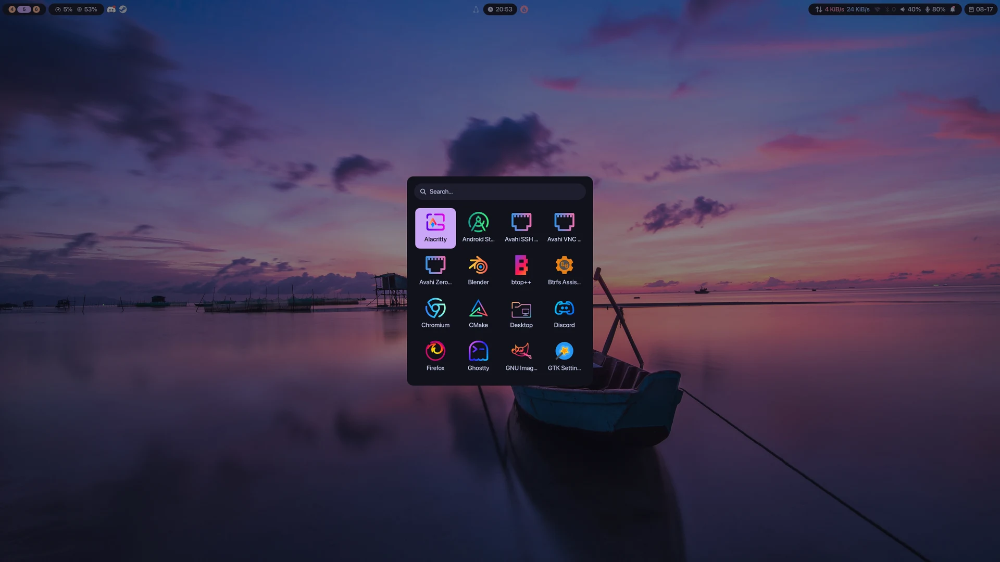
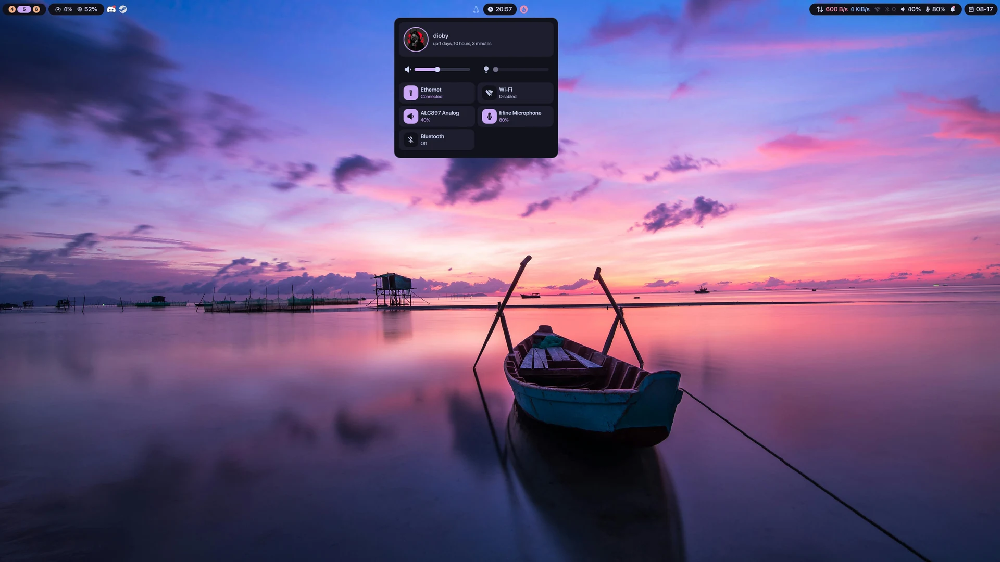

# Hyprshell

Hyprshell is a Wayland desktop shell for Hyprland that combines a bar, launcher, control center, notifications, screenshots, wallpapers, and internal palettes.

<div align="center">
  
</div>

<details>
<summary>More screenshots</summary>

|                                Launcher                                 |                             Control center                              |
| :---------------------------------------------------------------------: | :---------------------------------------------------------------------: |
|  |  |

|                                Notifications                                |                           Power menu                           |
| :-------------------------------------------------------------------------: | :------------------------------------------------------------: |
|  |  |

</details>

## What you get

- **A useful desktop surface:** workspaces, system status, tray, clock, network, audio, power, battery, brightness, and notifications.
- **Fast actions:** an app launcher, control center, notification history, power menu, and screenshot tool.
- **Personalization:** wallpaper browsing and thirteen internal palettes.
- **Graceful degradation:** unavailable radios, audio inputs, and other integrations remain unavailable or inert; battery and backlight modules hide when the hardware is absent.

## Requirements and support

| Area                     | Support                                                                                                                                            |
| ------------------------ | -------------------------------------------------------------------------------------------------------------------------------------------------- |
| Required runtime         | Hyprland and Quickshell (`qs`). Hyprshell uses Hyprland IPC and Wayland layer-shell surfaces.                                                      |
| Feature packages         | `awww`, `jq`, `imagemagick`, `libnotify`, `grim`, `slurp`, `wl-clipboard`, and the other packages in the installation command below.               |
| Optional integrations    | NetworkManager, BlueZ, PipeWire/WirePlumber, UPower, and power-profiles-daemon. Their services and features are independent of shell startup.      |
| Missing hardware         | Missing Bluetooth, Wi-Fi, Ethernet, or microphone stays unavailable or inert. Battery and backlight modules hide without matching hardware.        |
| Unsupported environments | Non-Hyprland compositors are not supported. Other distributions may work with equivalent packages, but this guide targets Arch Linux and Hyprland. |

## What Hyprshell does not manage

Hyprshell provides the desktop interface, not the surrounding session lifecycle. These responsibilities remain entirely user-owned:

- **Session manager:** starts and supervises the graphical session, prepares its environment, and manages its lifecycle.
- **Locker:** locks the screen and authenticates the user before restoring access.
- **Idle manager:** watches for inactivity and decides when to lock, turn displays off, or suspend the system.

Choose and configure these components independently. Hyprshell does not install, start, or replace them; its power menu only requests a session lock through `loginctl lock-session`.

## Quick start

### 1. Install dependencies

Install the stable packages from Arch's official repositories. No AUR helper is required for this setup.

```sh
sudo pacman -S --needed curl tar coreutils hyprland quickshell awww \
  ttf-nerd-fonts-symbols networkmanager bluez bluez-utils wireplumber \
  upower power-profiles-daemon accountsservice grim slurp wl-clipboard \
  jq imagemagick libnotify brightnessctl
```

`curl`, `tar`, and `coreutils` provide the downloader and archive/checksum tools used by the installer. Hyprland and Quickshell are startup-critical. The remaining packages support specific features such as networking, audio, notifications, screenshots, wallpapers, and typography.

### 2. Install Hyprshell

```sh
curl -fsSL https://raw.githubusercontent.com/adanft/hyprshell/main/install.sh | sh
```

The installer places the shell in `${XDG_CONFIG_HOME:-$HOME/.config}/hyprshell` and installs `bagent` in `$HOME/.local/bin` by default. It warns, rather than failing, if `qs` or Hyprland is not present. Re-running the command upgrades the installed files and preserves `settings.json`. The installer supplies starter wallpapers in `$HOME/Wallpapers` and preserves existing files.

### 3. Configure Hyprland

Hyprshell does not replace your Hyprland configuration. Add this setup to `hyprland.lua`, adapting the surrounding configuration to your environment. The startup hook launches both the wallpaper daemon and the shell:

```lua
local config_home = os.getenv("XDG_CONFIG_HOME")
if not config_home or config_home == "" then
    config_home = os.getenv("HOME") .. "/.config"
end

local hyprshell = config_home .. "/hyprshell"

hl.on("hyprland.start", function()
    hl.exec_cmd("awww-daemon")
    hl.exec_cmd("qs -p " .. hyprshell)
end)
```

Add the IPC keybinds you want below the startup hook:

```lua
hl.bind("SUPER + D", hl.dsp.exec_cmd("qs ipc -p " .. hyprshell .. " call applauncher toggle"))
hl.bind("SUPER + T", hl.dsp.exec_cmd("qs ipc -p " .. hyprshell .. " call themeselector toggle"))
hl.bind("SUPER + B", hl.dsp.exec_cmd("qs ipc -p " .. hyprshell .. " call wallpaperselector toggle"))
hl.bind("SUPER + X", hl.dsp.exec_cmd("qs ipc -p " .. hyprshell .. " call powermenu toggle"))
hl.bind("Print",     hl.dsp.exec_cmd("qs ipc -p " .. hyprshell .. " call screenshot toggle"))
```

### 4. Verify

Check the runtime, wallpaper daemon, and installed pairing agent together:

```sh
command -v qs
command -v hyprland || command -v Hyprland
command -v awww-daemon
command -v bagent
```

Then launch the shell directly if it is not already running:

```sh
config_home="${XDG_CONFIG_HOME:-$HOME/.config}"
qs -p "$config_home/hyprshell"
```

You should see the bar. Verify wallpaper changes and any keybinds you added.

## Typography

`ttf-nerd-fonts-symbols` provides `Symbols Nerd Font`, which Hyprshell uses for icons. The shell still starts without it, but icons render as missing-glyph boxes.

Body text requests `SF Pro Display`. It is not bundled or installed by `install.sh`; when it is absent, Qt uses another system font, so Hyprshell does not depend on it for startup. The files are available from the [San Francisco Pro Fonts repository](https://github.com/chris-short/apple-san-francisco-pro-fonts), whose README points back to Apple. Review the included restrictive Apple font license before installing or using it on Linux.

## Configuration and storage

- `settings.json` stores the current theme and wallpaper under `${XDG_CONFIG_HOME:-$HOME/.config}/hyprshell/`. It is created on first run and preserved by upgrades.

- Wallpapers are read from `$AWWW_WALLPAPERS_DIR`, or `$HOME/Wallpapers` when it is unset. Screenshots go to `$HOME/Pictures/Screenshots`.
- Cache data is stored under `${XDG_CACHE_HOME:-$HOME/.cache}/hyprshell/`.

## Troubleshooting

### Empty icon boxes

Confirm that `ttf-nerd-fonts-symbols` from the dependency step is installed, then restart the shell.

### The shell does not start

Check `qs` and Hyprland separately with the commands above, then confirm that the `-p` path uses the same XDG config directory as the installer. The installer only warns when either prerequisite is absent.

### Keybinds do nothing

The shell does not create Hyprland binds automatically. Add the IPC binds from the Quick start section and reload Hyprland.

### Wallpapers do not change

Confirm that `awww-daemon` starts from the Hyprland startup hook, then try again:

```sh
awww-daemon &
awww query
```

### Lock does nothing

The power menu calls `loginctl lock-session`; it does not provide a locker. Configure a locker such as hyprlock through hypridle, for example:

```ini
general {
    lock_cmd = pidof hyprlock || hyprlock
}
```

## Development

See [Development](docs/development.md) for the test environment and project conventions.

```sh
git clone https://github.com/adanft/hyprshell.git
cd hyprshell
./scripts/install-bagent.sh
qs -p "$PWD"
./run-tests.sh --js
```

## Credits

- [Quickshell](https://quickshell.org) by outfoxxed
- [Hyprland](https://hypr.land)
- Catppuccin, Kanagawa, Rosé Pine, Ayu, One Dark, Atom One, Palenight, Aura, Aurora X, and Hack The Box for the palettes

## License

[MIT](LICENSE)
